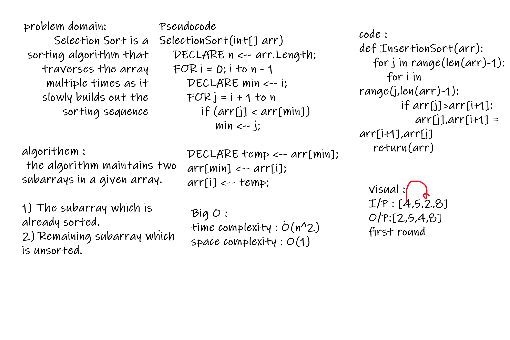

# Challenge Summary
<!-- Description of the challenge -->
Selection Sort is a sorting algorithm that traverses the array multiple times as it slowly builds out the sorting sequence
## Whiteboard Process
<!-- Embedded whiteboard image -->

## Approach & Efficiency
<!-- What approach did you take? Why? What is the Big O space/time for this approach? -->
Time: O(n^2)
Space: O(1)

## Solution
<!-- Show how to run your code, and examples of it in action -->
defination function
InsertionSort and give it array
I/P = InsertionSort([5,12,7,5,5,7])
O/P = [5, 5, 5, 7, 7, 12]

## test
default array test 1
Reverse-sorted: test 2
Few uniques: test 3
Nearly-sorted: test 4
