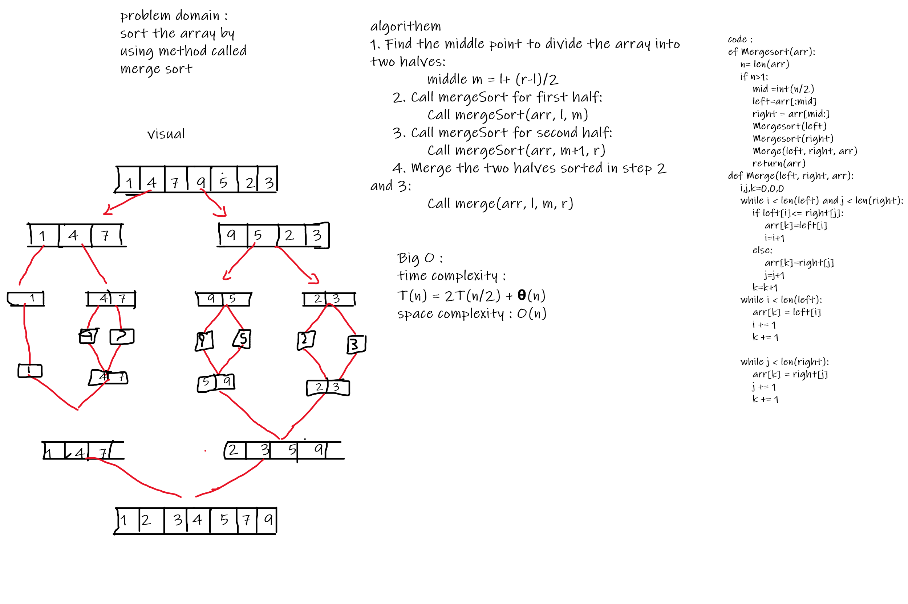

# Challenge Summary
<!-- Description of the challenge -->
sort the array by using method called merge sort
## Whiteboard Process
<!-- Embedded whiteboard image -->

## Approach & Efficiency
<!-- What approach did you take? Why? What is the Big O space/time for this approach? -->
time complexity :
T(n) = 2T(n/2) + θ(n)
space complexity : O(n)

## Solution
<!-- Show how to run your code, and examples of it in action -->
The merge() function is used for merging two halves. The merge(arr, l, m, r) is a key process that assumes that arr[l..m] and arr[m+1..r] are sorted and merges the two sorted sub-arrays into one.

## test
default array test2
reverse array test3
Few uniques: test4
Nearly-sorted: test5

# BLOG
[BLOG](BLOG.md)
