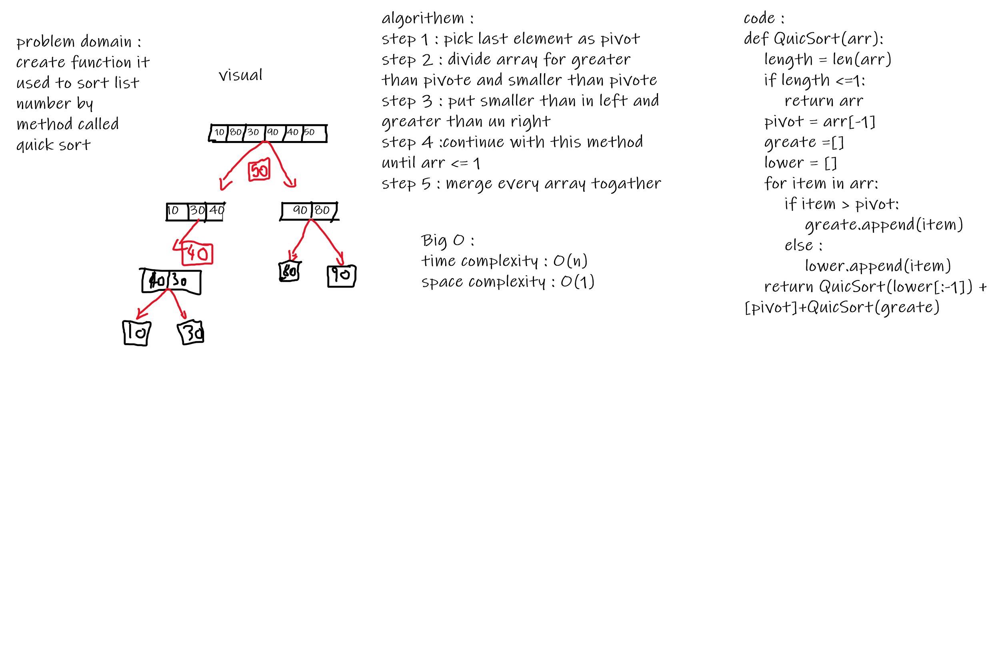

# Challenge Summary
<!-- Description of the challenge -->
sort the array by using method called quick sort
## Whiteboard Process
<!-- Embedded whiteboard image -->

## Approach & Efficiency
<!-- What approach did you take? Why? What is the Big O space/time for this approach? -->
time complexity : O(n)
space complexity : O(1)

## Solution
<!-- Show how to run your code, and examples of it in action -->
 QuickSort is a Divide and Conquer algorithm. It picks an element as pivot and partitions the given array around the picked pivot
 
## test
default array test2
reverse array test3
Few uniques: test4
Nearly-sorted: test5

# BLOG
[BLOG](BLOG.md)
