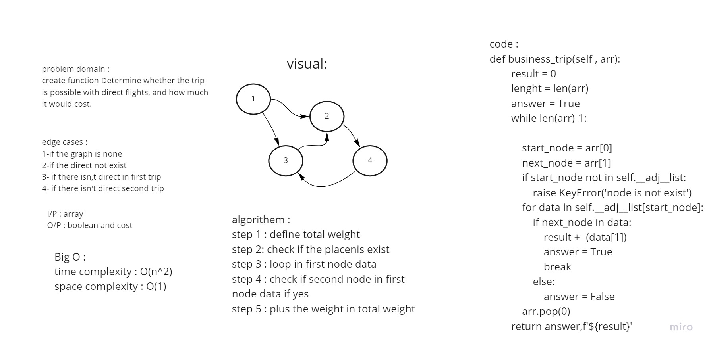

# Challenge Summary
<!-- Description of the challenge -->
create function Determine whether the trip is possible with direct flights, and how much it would cost.
## Whiteboard Process
<!-- Embedded whiteboard image -->

## Approach & Efficiency
<!-- What approach did you take? Why? What is the Big O space/time for this approach? -->
Big O : 
time complexity : O(n^2) because there is two loop 
space complexity : O(1) because every time we use two var

## Solution
<!-- Show how to run your code, and examples of it in action -->
step 1 : define total weight
step 2: check if the placenis exist
step 3 : loop in first node data
step 4 : check if second node in first node data if yes
step 5 : plus the weight in total weight