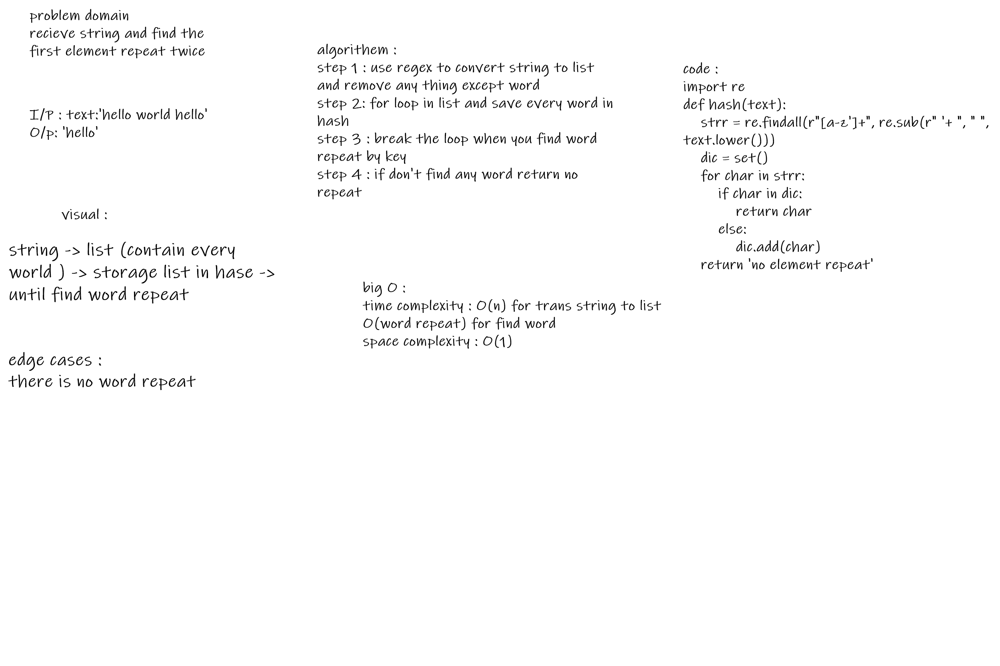

# Challenge Summary
<!-- Description of the challenge -->
recieve string and find the first element repeat twice
## Whiteboard Process
<!-- Embedded whiteboard image -->

## Approach & Efficiency
<!-- What approach did you take? Why? What is the Big O space/time for this approach? -->
big O :
time complexity : O(n) for trans string to list
O(word repeat) for find word
space complexity : O(1)

## Solution
<!-- Show how to run your code, and examples of it in action -->
string -> list (contain every world ) -> storage list in hase -> until find word repeat

### test
test 1 and 2 give string contain word repeat
test 3 the word is char
test 4 no repeat
