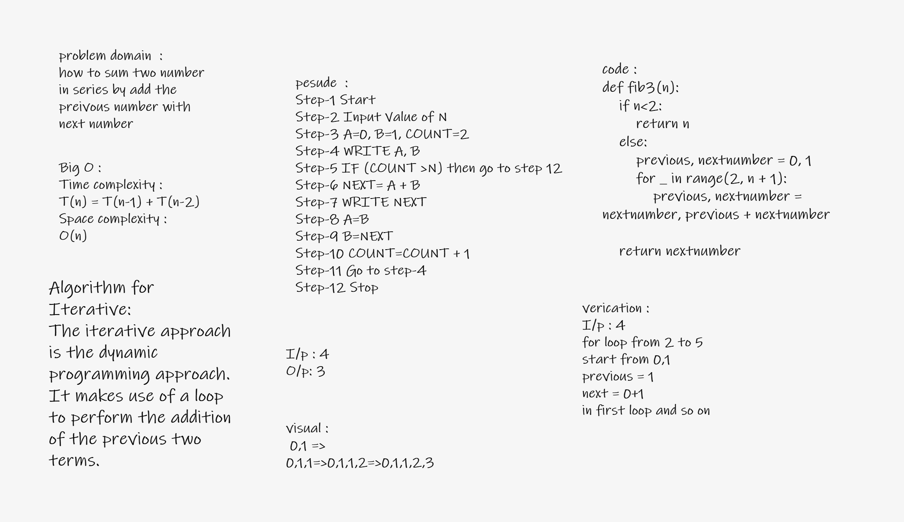

#  Fibonacci Sequence
how to sum two number in series by add the preivous number with next number

Whiteboard Process

excel
[excel link ](https://docs.google.com/spreadsheets/d/17H9fd92dAy0TrGLCVOMYFaI_wOMOETymE5-NnFOUNWc/edit#gid=0)
