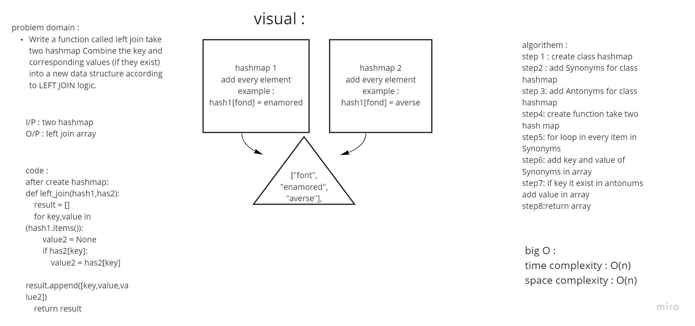

# Hashmap LEFT JOIN
<!-- Short summary or background information -->
the hashmap it depend on asci number for char and storage the data in same index of sum asci number
## Challenge
<!-- Description of the challenge -->
I/p two hashmap it contain key and value then compare two hashmap then contain the value for same key
## Approach & Efficiency
<!-- What approach did you take? Why? What is the Big O space/time for this approach? -->
big O : 
time complexity : O(n) 
space complexity : O(n)
## Solution
<!-- Embedded whiteboard image -->

