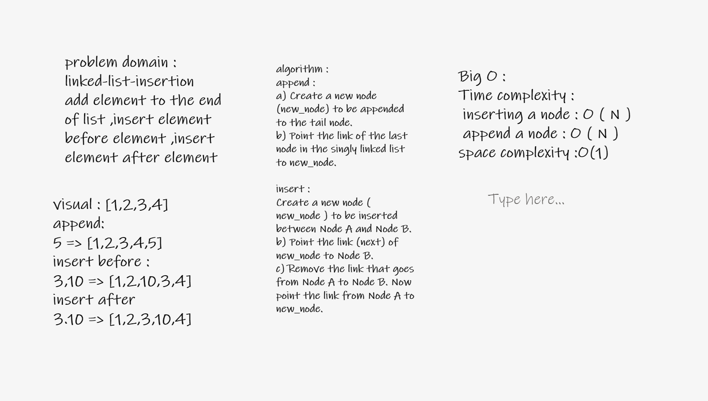

# Challenge Summary
<!-- Description of the challenge -->
Create a Node class that has properties for the value stored in the Node, and traversed on it and doing some functio
## Whiteboard Process
<!-- Embedded whiteboard image -->

## Approach & Efficiency
<!-- What approach did you take? Why? What is the Big O space/time for this approach? -->
improve your skill in linked list and how to deal with it
Big O in image
## Solution
<!-- Show how to run your code, and examples of it in action -->
1. append--->

        original= "head -> [1] -> [2] -> [3] -> x"
        linkedlist.append(4)
        expected = "head -> [1] -> [2] -> [3] -> [4] -> x"

2. insert before

        original= "head -> [1] -> [2] -> [3] -> x"
        linkedlist.insert_before(2,"hi")
        expected = "head -> [1] -> [hi] -> [2] -> [3] -> [4] -> x"

3. insert after---> time O(n) space O(1)

        original= "head -> [1] -> [2] -> [3] -> x"
        linkedlist.insert_after(2,"hi")
        expected = "head -> [1] -> [2] -> [hi] -> [3] -> [4] -> x"
## API
<!-- Description of each method publicly available to your Linked List -->
first method is : append : it add element in list form end
second methoe is  :insert before : insert element before ele
third method is insert after : insert element after ele

second class : Node it pointer in the next value

## Task test
Can successfully add a node to the end of the linked list test2
Can successfully add multiple nodes to the end of a linked list test3
Can successfully insert a node before a node located i the middle of a linked list test4
Can successfully insert a node before the first node of a linked list test5
Can successfully insert after a node in the middle of the linked list test6
Can successfully insert a node after the last node of the linked list test7
