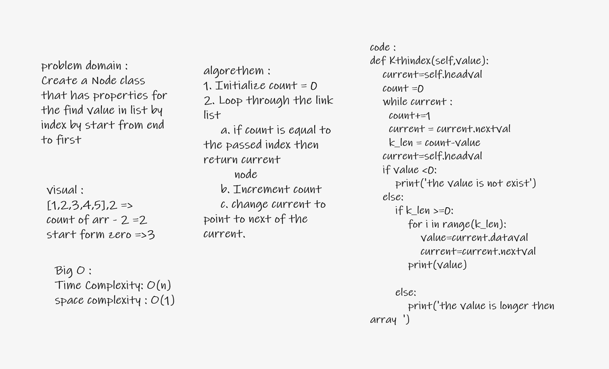

# Challenge Summary
<!-- Description of the challenge -->
Create a Node class that has properties for the find value in list by index by start from end to first
## Whiteboard Process
<!-- Embedded whiteboard image -->

## Approach & Efficiency
<!-- What approach did you take? Why? What is the Big O space/time for this approach? -->
improve your skill in linked list and how to deal with it
Big O in image
## Solution
<!-- Show how to run your code, and examples of it in action -->
1. array--->

        LinkeKth.array([1,2,3,4])
        expected = "head -> [1] -> [2] -> [3] -> [4] -> x"

2. Kthindex

        original= "head -> [1] -> [2] -> [3] -> [4] -> x"
        LinkeKth.Kthindex(2)
        expected = "2"

## API
<!-- Description of each method publicly available to your Linked List -->
first method is : array : it add array to linkedlist
second methoe is  :Kthindex : find ele by index

second class : Node it pointer in the next value

## Task test
Where k is greater than the length of the linked list test1
Where k and the length of the list are the same test2
Where k is not a positive integer test6
Where the linked list is of a size 1 test5
“Happy Path” where k is not at the end, but somewhere in the  middle of the linked list test3 & 4
