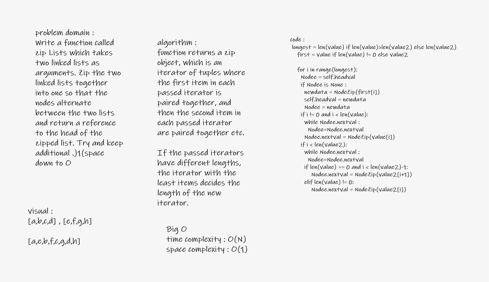

# Challenge Summary
<!-- Description of the challenge -->
Create a Node class that has properties for the zip two list togather
## Whiteboard Process
<!-- Embedded whiteboard image -->

## Approach & Efficiency
<!-- What approach did you take? Why? What is the Big O space/time for this approach? -->
improve your skill in linked list and how to deal with zio function and understand it
Big O in image
## Solution
<!-- Show how to run your code, and examples of it in action -->
1. Zip--->

        LinkedZip.Zip([1,2,3,4],[5,6,7,8])
        expected = "'head -> [1] -> [5] -> [2] -> [6] -> [3] -> [7] -> [4] -> [8] -> x'"

## API
<!-- Description of each method publicly available to your Linked List -->
first method is : Zip : Zip the two linked lists together into one
second methoe is  :to_string : print the result

second class : Node it pointer in the next value

## Task test
where two list have same size / test1
where list two is longer than list one / test5
where list one is longer than list two /test6
where two list are empty / test2
where list two is empty / test4
where list one is empty / test3
