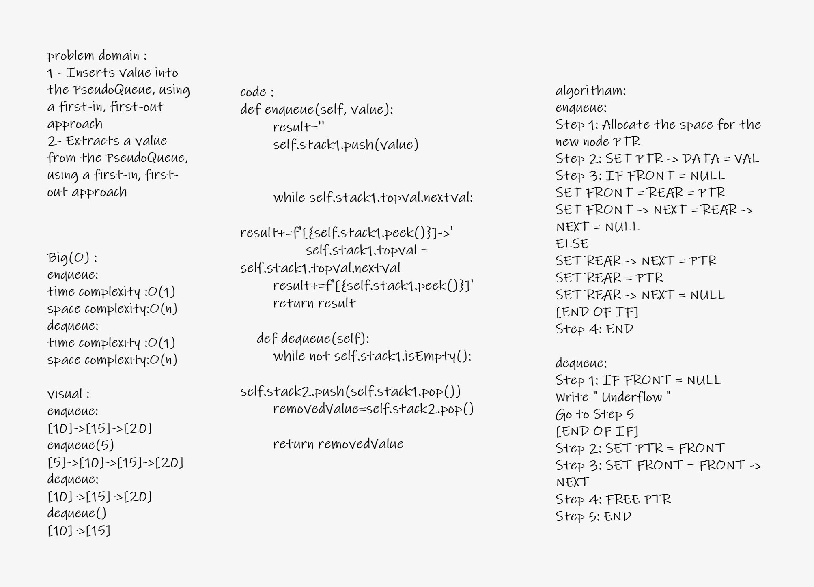

# Stacks and Queues
<!-- Short summary or background information -->
Stack  : is a linear data structure that follows a particular order in which the operations are performed. The order may be LIFO(Last In First Out) or FILO(First In Last Out).

 Queue : is a linear structure which follows a particular order in which the operations are performed. The order is First In First Out (FIFO)

 The difference between stacks and queues is in removing. In a stack we remove the item the most recently added; in a queue, we remove the item the least recently added.
## Challenge
<!-- Description of the challenge -->
use linkedlist method to create stack and queue
## Approach & Efficiency
<!-- What approach did you take? Why? What is the Big O space/time for this approach? -->
stake : time complexity : O(1)
        space comlexity : O(n)

queue : time complexity : O(1)
        space comlexity : O(n)

## API
<!-- Description of each method publicly available to your Stack and Queue-->
 ### Operations on Queue:
Mainly the following four basic operations are performed on queue:
 * Enqueue: Adds an item to the queue. If the queue is full, then it is said to be an Overflow condition.
 * Dequeue: Removes an item from the queue. The items are popped in the same order in which they are pushed. If the queue is empty, then it is said to be an Underflow condition.
 * Front: Get the front item from queue.
 * Rear: Get the last item from queue.

### Operations on Stack:
* Push: Adds an item in the stack. If the stack is full, then it is said to be an Overflow condition.
* Pop: Removes an item from the stack. The items are popped in the reversed order in which they are pushed. If the stack is empty, then it is said to be an Underflow condition.
* Peek or Top: Returns the top element of the stack.
* isEmpty: Returns true if the stack is empty, else false.

 * Can successfully push onto a stack ✔
 * Can successfully push multiple values onto a stack ✔
 * Can successfully pop off the stack  ✔
 * Can successfully empty a stack after multiple pops ✔
 * Can successfully peek the next item on the stack ✔
 * Can successfully instantiate an empty stack ✔
 * Calling pop or peek on empty stack raises exception ✔
 * Can successfully enqueue into a queue ✔
 * Can successfully enqueue multiple values into a queue ✔
 * Can successfully dequeue out of a queue the expected value ✔
 * Can successfully peek into a queue, seeing the expected value ✔
 * Can successfully empty a queue after multiple dequeues ✔
 * Can successfully instantiate an empty queue ✔
 * Calling dequeue or peek on empty queue raises exception ✔

# Challenge Summary
<!-- Description of the challenge -->
to implements queue using stack:

enqueue using push and peek
dequeue using push and pop
## Whiteboard Process
<!-- Embedded whiteboard image -->

## Approach & Efficiency
<!-- What approach did you take? Why? What is the Big O space/time for this approach? -->
queue : time complexity : O(1)
        space comlexity : O(n)
## Solution
<!-- Show how to run your code, and examples of it in action -->

    actual = data.enqueue(4)
    expected = "[4]->[3]->[2]->[1]"

### Operations on Stack:

enqueue in empty string test 15
enqueue in not empty string test 14
dequeue in not empty string test 16

