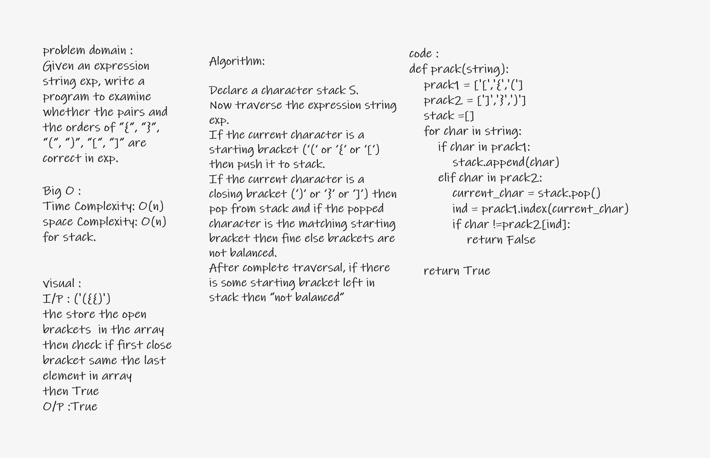

# Challenge Summary
<!-- Description of the challenge -->
Given an expression string exp, write a program to examine whether the pairs and the orders of “{“, “}”, “(“, “)”, “[“, “]” are correct in exp.

## Whiteboard Process
<!-- Embedded whiteboard image -->

## Approach & Efficiency
<!-- What approach did you take? Why? What is the Big O space/time for this approach? -->
Time Complexity: O(n)
Auxiliary Space: O(n) for stack.
## Solution
<!-- Show how to run your code, and examples of it in action -->
prack function
I/P : ('({{)')
the store the open brackets  in the array
then check if first close bracket same the last element in array
then True
O/P :True

Test
Input	                        Output
{}	                            TRUE
{}(){}	                        TRUE
()[[Extra Characters]]	        TRUE
(){}[[]]	                    TRUE
{}{Code}[Fellows](())	        TRUE
[({}]	                        FALSE
(](	                            FALSE
{(})	                        FALSE
