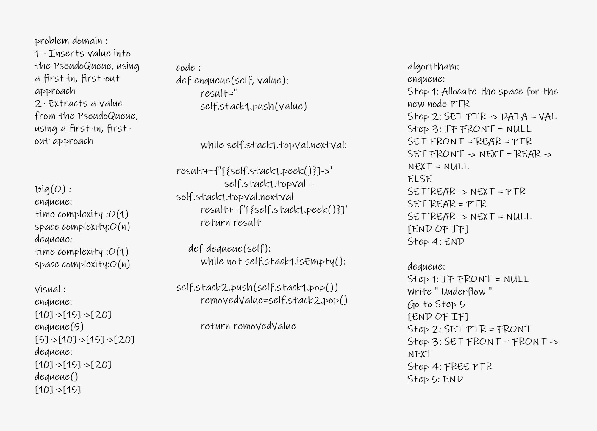

# Challenge Summary
<!-- Description of the challenge -->
to implements queue using stack:

enqueue using push and peek
dequeue using push and pop
## Whiteboard Process
<!-- Embedded whiteboard image -->

## Approach & Efficiency
<!-- What approach did you take? Why? What is the Big O space/time for this approach? -->
queue : time complexity : O(1)
        space comlexity : O(n)
## Solution
<!-- Show how to run your code, and examples of it in action -->

    actual = data.enqueue(4)
    expected = "[4]->[3]->[2]->[1]"

### Operations on Stack:

enqueue in empty string test 2
enqueue in not empty string test 1
dequeue in not empty string test 3

