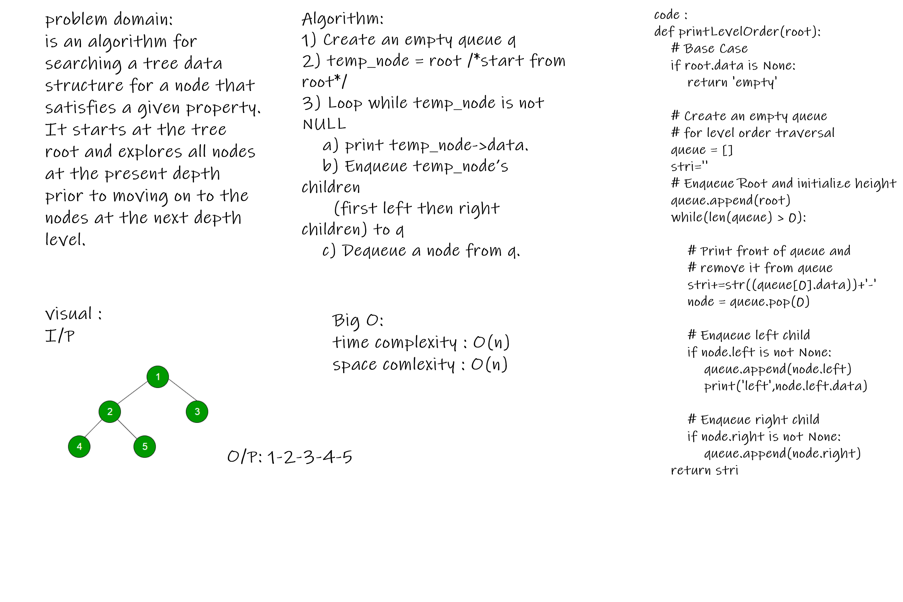

# Challenge Summary
<!-- Description of the challenge -->
is an algorithm for searching a tree data structure for a node that satisfies a given property. It starts at the tree root and explores all nodes at the present depth prior to moving on to the nodes at the next depth level.

## Whiteboard Process
<!-- Embedded whiteboard image -->

## Approach & Efficiency
<!-- What approach did you take? Why? What is the Big O space/time for this approach? -->
Bio O :
time : O(n)
space : O(n)
## Solution
<!-- Show how to run your code, and examples of it in action -->
function printLevelOrder(root):
 root = Node(1)
    expected = printLevelOrder(root)
    actual ='1-'

## test
test 1 add multipel data
 
test 2 add one data
 
test 3 add empty data
