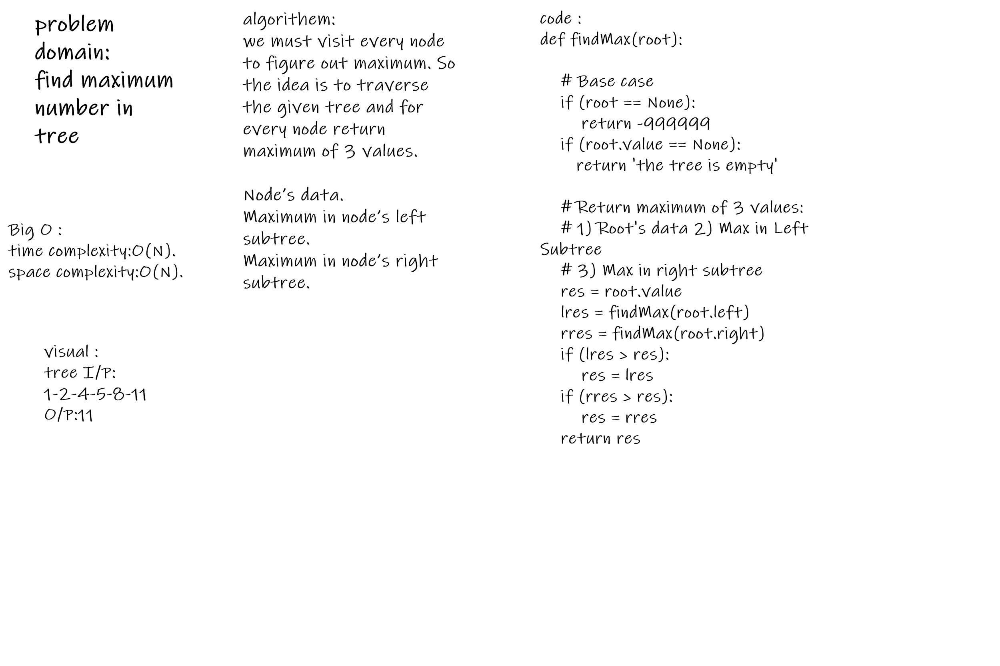

# Challenge Summary
<!-- Description of the challenge -->
Given a Binary Tree, find the maximum(or minimum) element in it. For example, maximum in the following Binary Tree is 9.
## Whiteboard Process
<!-- Embedded whiteboard image -->

## Approach & Efficiency
<!-- What approach did you take? Why? What is the Big O space/time for this approach? -->
Node’s data.
Maximum in node’s left subtree.
Maximum in node’s right subtree.

## Solution
<!-- Show how to run your code, and examples of it in action -->
use
fucntion max
    tree = Node(1)
    expected =1

## test
test 1  find max for multi input
test 3  find max for one input
test 2  find max for empty input
