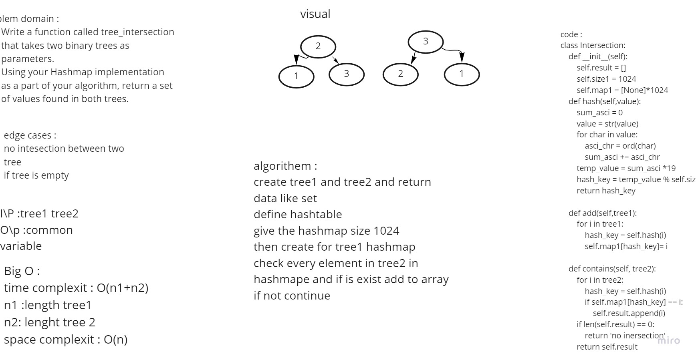

# Challenge Summary
<!-- Description of the challenge -->
Write a function called tree_intersection that takes two binary trees as parameters.

## Whiteboard Process
<!-- Embedded whiteboard image -->

## Approach & Efficiency
<!-- What approach did you take? Why? What is the Big O space/time for this approach? -->
Big O :
time complexit : O(n1+n2)
n1 :length tree1
n2: lenght tree 2
space complexit : O(n)

## Solution
<!-- Show how to run your code, and examples of it in action -->
add tree1 to hash
add(tree1) -> conver tree1 to hashmap
contains(ree2) -> check every element is exist on hashmap
## test
test 1  there is common between two tree
test 2 there is not common between two tree
